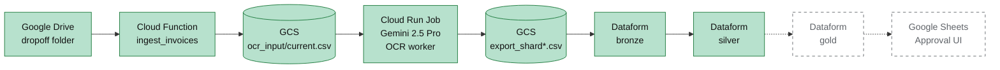

# Invoice OCR & Payment-Approval Pipeline

> An end-to-end GCP pipeline that turns supplier invoice PDFs into a reviewed, approved payment run — built to replace hours of manual finance review each week.


---

## The problem

On every payment-run week, a finance manager has to pay hundreds of supplier invoices.

Today that means:

- opening every invoice PDF one at a time
- cross-referencing the account number, sort code, and IBAN printed on the invoice against the bank details already held for that supplier in the financial system, confirming they match before payment goes out
- cross-referencing the job number on the invoice against an internal project list, making sure we have enough funds on that job to pay the supplier
- then finally, releasing the pre-generated BACS file to the bank and hoping nothing was missed

There is no manual keying into the bank — the BACS file is produced by the financial system — but the human cost sits in the *verification* step above, and the blast radius of missing a mismatch is a payment sent to the wrong account.

**The pipeline in this repo replaces the mechanical extraction and pre-flags anomalies, so the manager only reviews exceptions — not every invoice.**

---

## How it works



Green nodes are in production; dashed nodes are **designed but not yet deployed** — the gold layer and Sheets UI are the remaining piece of the finance approval workflow (see [What's shipped vs. what's designed](#whats-shipped-vs-whats-designed) below).

---

## The components

### 1. [ingestion_function/](ingestion_function/) — Google Drive → GCS

A Cloud Function (Gen 2, HTTP-triggered) that polls a Drive dropoff folder for new spreadsheets of invoice URLs, filters out any URL already seen, writes the net-new list to GCS as CSV, and archives the processed spreadsheet.

**Engineering decision worth noting:** URL deduplication is backed by a dedicated Firestore database, keyed by SHA-256 of the URL. This is the idempotency layer — reruns of the function never re-submit the same invoice for extraction, even if the upstream spreadsheet is re-dropped.

### 2. [Vertex_AI_Cloud_Run/](Vertex_AI_Cloud_Run/) — the OCR worker

A sharded Cloud Run Job that downloads each invoice, validates it (page count, image dimensions, MIME type), sends it to Gemini 2.5 Pro via Vertex AI, post-processes the returned JSON, and writes a sharded CSV back to GCS. Parallelism is handled natively by Cloud Run Jobs via `CLOUD_RUN_TASK_INDEX`.

**Engineering decisions worth noting:**

- **SSRF-hardened downloader.** The worker accepts user-supplied URLs (invoices live on Drive, external CDNs, etc.), so the downloader pins DNS resolution, rejects private/link-local IP ranges, and blocks the GCE metadata endpoint outright — a malicious URL can't trick the worker into fetching cloud credentials or scanning the internal network.
- **Async Gemini calls with a token bucket.** The worker runs extractions concurrently under an `asyncio.Semaphore` *and* a rolling 60-second RPM limiter, so it stays inside Gemini's quota while maxing throughput. Configurable via `OCR_GEMINI_CONCURRENT_LIMIT` / `OCR_GEMINI_RPM_LIMIT`.
- **SIGTERM-safe.** A Cloud Run Job task that receives SIGTERM (preemption or redeploy) stops picking up new invoices but finishes its current batch and flushes a partial export — nothing in flight is silently lost.
- **Leading-zero-safe banking fields.** Account numbers and sort codes are written with a leading apostrophe so Excel/Sheets don't strip the zero when the CSV is opened. The downstream Dataform silver layer strips the apostrophe when casting.

### 3. [dataform/](dataform/) — Dataform models

A medallion-architecture Dataform project that loads the worker's CSV shards into BigQuery and cleans them up in layers:

- **bronze** ([bronze_ocr_raw.sqlx](dataform/definitions/bronze/bronze_ocr_raw.sqlx), [bronze_ocr_rejected.sqlx](dataform/definitions/bronze/bronze_ocr_rejected.sqlx)) — raw `LOAD DATA` from GCS, everything STRING, no transformation. The rejection loader tolerates zero-match globs so a clean run with no rejections doesn't fail the pipeline.
- **silver** ([silver_te_ocr_results.sqlx](dataform/definitions/silver/silver_te_ocr_results.sqlx), [silver_te_ocr_rejected.sqlx](dataform/definitions/silver/silver_te_ocr_rejected.sqlx)) — incremental merges keyed on the invoice URL; strips apostrophes, parses UK-format dates, casts financial fields to NUMERIC, and deduplicates rows where the same link was extracted twice (keeps the richer row).
- **gold** ([gold_payment_approval_queue.sqlx](dataform/definitions/gold/gold_payment_approval_queue.sqlx)) — 📐 **designed, not deployed.** Joins silver with business rules to pre-classify each invoice as `READY_TO_PAY`, `NEEDS_REVIEW`, or `BLOCKED` and surfaces the reasons. This is what the Sheets UI consumes.

---

## What's shipped vs. what's designed

Being honest about status so you can see the whole solution, not just the built parts:

| Stage | Status | Where |
|---|---|---|
| Drive → GCS ingestion | ✅ Production | [ingestion_function/](ingestion_function/) |
| OCR worker (Gemini 2.5 Pro) | ✅ Production | [Vertex_AI_Cloud_Run/](Vertex_AI_Cloud_Run/) |
| Bronze & silver Dataform layers | ✅ Production | [dataform/definitions/bronze/](dataform/definitions/bronze/), [dataform/definitions/silver/](dataform/definitions/silver/) |
| **Gold layer (payment approval queue)** | 📐 Designed | [dataform/definitions/gold/gold_payment_approval_queue.sqlx](dataform/definitions/gold/gold_payment_approval_queue.sqlx) |
| **Google Sheets approval UI** | 📐 Designed | [apps_script/](apps_script/) |
| Cloud Workflow orchestration | 📐 Designed | [Workflow/](Workflow/) is the intended location |

The designed pieces are committed as real files — the gold SQL has the business rules written out, and the Apps Script has the full menu/refresh/approve/export flow scaffolded — so the full end-to-end solution is legible without having to imagine it.

---

## Extracted fields

Every invoice produces one row with the following columns:

### Banking details
Account Name · Bank Name · Account Number · Sort Code · Routing Number · Transit Number · Branch Code · SWIFT/BIC · IBAN

### Invoice details
Invoice Number · Invoice Date · Due Date · Currency · Subtotal · Tax Amount · Tax Rate · Total Amount · Document Type · Credit Note Reference · Payment Terms · Job Number · Accounting Description

### Vendor details
Vendor Name · Vendor TAX Number · Vendor Address

### Pass-through (preserved from the input spreadsheet)
Office Code · Office Name · Master Supplier Code · Master Supplier Name · Supplier Code · Supplier Name · Invoice No · Expected Job Number · Link

---

## Configuration

Every component reads its config from environment variables — no secrets live in source. See [ingestion_function/.env.example](ingestion_function/.env.example) and [Vertex_AI_Cloud_Run/.env.example](Vertex_AI_Cloud_Run/.env.example) for the full list. Dataform defaults live in [dataform/workflow_settings.yaml](dataform/workflow_settings.yaml).

The required env vars at a glance:

| Component | Required vars |
|---|---|
| Ingestion function | `OCR_PROJECT_ID`, `OCR_GCS_BUCKET_NAME`, `OCR_DRIVE_DROPOFF_FOLDER_ID`, `OCR_DRIVE_ARCHIVE_FOLDER_ID` |
| OCR worker | `OCR_PROJECT_ID`, `OCR_INPUT_GCS_PATH`, `OCR_EXPORT_BUCKET_NAME` |
| Apps Script | Script Properties: `GCP_PROJECT_ID`, `GOLD_TABLE_FQN`, `AUDIT_TABLE_FQN`, `BQ_LOCATION` |

---

## Deployment

The commands below are illustrative — replace `your-gcp-project` with your actual project.

```bash
# APIs and a Firestore database for URL deduplication
gcloud services enable \
  firestore.googleapis.com \
  dataform.googleapis.com \
  run.googleapis.com \
  cloudfunctions.googleapis.com \
  aiplatform.googleapis.com \
  --project=your-gcp-project

gcloud firestore databases create \
  --location=europe-west2 \
  --type=firestore-native \
  --project=your-gcp-project
```

```bash
# Ingestion function
gcloud functions deploy ingest_invoices \
  --gen2 --region=europe-west2 --runtime=python311 \
  --source=ingestion_function/ \
  --entry-point=ingest_invoices \
  --trigger-http \
  --set-env-vars=OCR_PROJECT_ID=your-gcp-project,OCR_GCS_BUCKET_NAME=your-landing-bucket,OCR_DRIVE_DROPOFF_FOLDER_ID=...,OCR_DRIVE_ARCHIVE_FOLDER_ID=...
```

```bash
# OCR worker
gcloud builds submit Vertex_AI_Cloud_Run/ \
  --tag gcr.io/your-gcp-project/bank-ocr-worker

gcloud run jobs create bank-ocr-worker \
  --image=gcr.io/your-gcp-project/bank-ocr-worker \
  --region=europe-west2 \
  --tasks=5 \
  --set-env-vars=OCR_PROJECT_ID=your-gcp-project,OCR_INPUT_GCS_PATH=gs://your-landing-bucket/ocr_input/current.csv,OCR_EXPORT_BUCKET_NAME=your-landing-bucket,OCR_SHARD_COUNT=5
```

```bash
# Dataform repository (link to Git, or push dataform/ contents directly)
gcloud dataform repositories create ocr-pipeline-dataform \
  --region=europe-west2 --project=your-gcp-project
```

### IAM in one paragraph

Three service accounts are involved. The **Cloud Function SA** needs `roles/datastore.user` for the Firestore dedupe store and `roles/storage.objectAdmin` on the landing bucket. The **Cloud Run Job SA** needs `roles/aiplatform.user` for Vertex AI + `roles/storage.objectAdmin` on the landing bucket. The **Dataform-managed SA** (Google-managed, format `service-{PROJECT_NUMBER}@gcp-sa-dataform.iam.gserviceaccount.com`) needs `roles/bigquery.dataEditor`, `roles/bigquery.jobUser`, and `roles/storage.objectViewer` on the landing bucket so `LOAD DATA` can read the shards.

---

## Engineering highlights

A quick scan for what's interesting in here:

- **Medallion architecture** (bronze → silver → gold) implemented in Dataform with incremental merges keyed on the invoice URL for safe re-runs.
- **SSRF defence-in-depth** in the OCR worker: DNS pinning, private-IP rejection, metadata-endpoint blocklist.
- **Async + token-bucket rate limiting** around Gemini calls — saturates throughput without tripping quota.
- **Graceful SIGTERM** handling on Cloud Run Jobs so preempted tasks flush partial exports rather than losing work.
- **Idempotent ingestion** via Firestore-backed URL dedup — safe to re-trigger the whole pipeline without producing duplicate BigQuery rows.
- **Apostrophe-prefixed string loads** through bronze so leading-zero sort codes survive the CSV → BigQuery round trip; stripped on the silver cast.

---

## License

[MIT](LICENSE)
